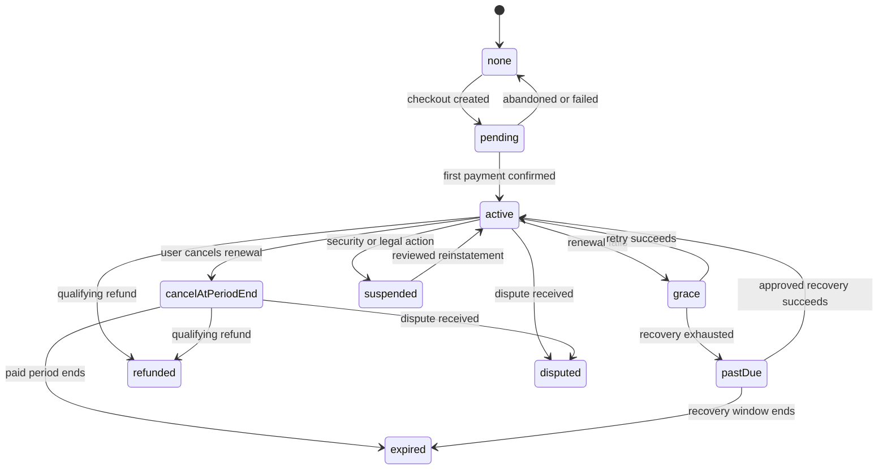

# YT Downloader Pro Account, Billing, And Entitlement Architecture

## Document Control

| Field | Value |
| --- | --- |
| Status | Phase 1 architecture; implementation blocked by launch gates |
| Product owner | Ta-Chou Weng |
| Prepared | 2026-08-26 |
| Initial client | macOS Swift 2.x |
| Payment provider | ECPay candidate, pending written approval |

This document defines boundaries and testable contracts so another engineer can
implement the system after approval. It is not permission to create production
accounts, payment orders, secrets, or checkout.

## Implemented Phase 1 Boundary

The current macOS Swift 2.x app contains only a local mock authentication
skeleton. It has synthetic Google- and Apple-labelled providers, local
Keychain restoration, and presentation-only mock plan labels behind the exact
`YTDP_AUTH_MODE=mock` development gate. It has no real identity provider,
account, backend, billing, subscription state, entitlement delivery, paid
feature enforcement, or external submission.

Apple is a future identity-provider candidate alongside Google. Neither Apple
nor Google sign-in is implemented. Every flow and service described below is a
proposed real account, billing, and entitlement architecture and remains
subject to separate approved specifications, plans, provider and commercial
gates, and external-account approvals.

## 1. Design Principles

- The free app works without an account and without contacting the entitlement
  backend, except for the existing update mechanism.
- Google proves identity; it does not decide whether a user paid.
- ECPay reports payment events; it does not directly control app features.
- The server owns subscription state and issues signed entitlements.
- The app enforces feature policy at command and helper-argument boundaries, not
  only by hiding controls.
- Browser cookies, media URLs, titles, files, paths, and local history do not
  enter identity, billing, or entitlement requests.
- Client applications cannot keep secrets. No Google client secret, ECPay
  HashKey/HashIV, database credential, or signing private key ships in the app.
- Paid access is recoverable during reasonable outages and revocable for valid
  refunds, disputes, or account security actions.
- Feature gating is a commercial control, not DRM. A determined local attacker
  can patch a desktop binary; the product will not invade user privacy in an
  attempt to make that impossible.

## 2. Service Boundaries

| Component | Responsibility | Must not own |
| --- | --- | --- |
| macOS app | Login presentation, Keychain session, entitlement verification, feature policy, account/support UI | Provider secrets, canonical billing state |
| Auth service | Google OIDC exchange/verification, internal account, recovery, sessions | Download activity or payment transitions |
| Billing adapter | ECPay order creation, callback verification, query/reconciliation, cancellation/refund commands | App UI or Google tokens |
| Subscription service | Canonical subscription state machine and period calculation | Raw card data or media activity |
| Entitlement service | Derive signed feature grants from account/subscription state | Payment-provider-specific UI behavior |
| Support service | Reviewed tickets, attachments, priority routing | Silent diagnostics or download monitoring |
| Admin console | Least-privilege support/billing actions and audit history | Direct database mutation without workflow |

The provider-specific `ECPayBillingAdapter` implements an internal
`BillingProvider` interface. A future provider replacement must not change the
app's entitlement contract or leak provider fields into Swift views.

## 3. Authentication Flow

### 3.1 Free user

1. User installs and opens the app.
2. A local anonymous/free policy grants up to 720p and approved free features.
3. No installation or account identifier is sent to the operator merely to use
   free downloads.

### 3.2 Google sign-in

1. The app generates a high-entropy PKCE verifier/challenge, `state`, and OIDC
   `nonce` for one attempt.
2. The app opens the system browser, never an embedded `WKWebView`.
3. Google authenticates the user and returns an authorization code through the
   registered desktop redirect.
4. The backend exchanges or validates the code using the exact approved flow,
   verifies issuer, audience, signature, expiry, nonce, state binding, and PKCE.
5. The backend keys the external identity by `(issuer, sub)`, not email.
6. The backend creates or finds the internal account and returns a one-time app
   completion code.
7. The app exchanges that code for an operator access token and rotating refresh
   credential, stores the refresh credential in Keychain, and erases transient
   verifier/code values.

Only OpenID and the minimum identity scopes approved in the Privacy Data Map are
requested. The product does not request YouTube, Contacts, Drive, channel, or
other Google API access for subscription identity.

### 3.3 Account recovery

Before launch, define a second reviewed recovery method, recommended as an
email magic link. Recovery must require recent proof, send security notices,
revoke or rotate sessions after sensitive changes, and never rely on support
staff manually changing database identities.

A Google disconnect is allowed only after another verified login method is
attached or during complete account deletion.

## 4. Payment Flow

The final ECPay product/API names depend on written approval. The logical flow is:

1. Authenticated user selects Pro on the HTTPS website or an app-opened HTTPS
   checkout route.
2. Backend creates an internal pending subscription/order with an idempotency
   key and displays recurring terms before redirecting to an approved ECPay
   payment surface.
3. The browser, not the app, handles payment entry.
4. ECPay sends the browser result for user experience and a server-to-server
   recurring authorization result to the configured callback.
5. The billing adapter verifies the provider signature/check value, validates
   amount/currency/order identity, rejects replays, records the immutable event,
   and acknowledges idempotently.
6. The backend queries/reconciles provider state where required. A browser
   redirect alone never activates Pro.
7. The subscription state machine accepts or rejects the transition.
8. Entitlement service derives the new feature grant.
9. The app refreshes entitlement and presents the result in localized language.

Every provider request/response is sanitized before logging. HashKey, HashIV,
full callback bodies, card information, and personal fields do not enter general
application logs.

## 5. Subscription State Machine

Canonical states:

- `none`: no subscription.
- `pending`: order created; no confirmed first authorization.
- `active`: current period paid and not cancelled immediately.
- `cancelAtPeriodEnd`: paid access continues; renewal is stopped.
- `grace`: a scheduled authorization failed and recovery is permitted.
- `pastDue`: payment remains unresolved after the grace policy.
- `expired`: paid period ended without a successful renewal.
- `refunded`: applicable payment was refunded according to policy.
- `disputed`: provider reports chargeback/dispute; access policy is reviewed.
- `suspended`: security, abuse, legal, or provider action with an auditable reason.

Allowed high-level transitions:

Events are append-only; current state is derived through validated transitions.
Duplicate and out-of-order callbacks must not duplicate periods, refunds, or
entitlements.

## 6. Entitlement Contract

The backend issues a compact signed token that the app can verify with a pinned
public key. A standards-based format such as JWT with a currently approved
asymmetric algorithm may be used after security review.

Minimum claims:

| Claim | Meaning |
| --- | --- |
| `iss` | Exact entitlement issuer |
| `aud` | macOS product identifier |
| `sub` | Opaque internal user ID |
| `iat`, `nbf`, `exp` | Issue, not-before, and expiration times |
| `jti` | Unique token identifier |
| `schema` | Entitlement schema version |
| `plan` | `free` or `pro` |
| `features` | Stable feature identifiers |
| `maxVideoHeight` | 720 for free; Pro policy value when active |
| `subscriptionState` | Safe presentation state, not provider internals |
| `periodEnd` | Current paid access boundary when applicable |
| `installationID` | Optional random installation binding if device policy is approved |

Feature identifiers are additive and stable, for example:

- `download.single`
- `video.hd`
- `video.uhd`
- `queue.batch`
- `playlist.expand`
- `subtitle.advanced`
- `format.presets`
- `recovery.full`
- `history.sync`
- `support.priority`

Unknown features are ignored. Unknown entitlement schema versions fail to a
safe local free policy with a clear account error; they do not crash the app.

## 7. Expiry And Offline Policy

Initial proposal for security and user review:

- Signed entitlement lifetime: 24 hours.
- Normal refresh: before expiry when network is available.
- Offline grace for a previously active paid user: 72 hours after the last
  valid entitlement expires.
- After offline grace: retain local data and account state but apply free limits
  until verification succeeds.
- A transient outage never deletes jobs, history, files, presets, or account
  data.

The app clearly distinguishes:

- Offline or entitlement server unavailable.
- Google session expired.
- Payment past due.
- Subscription cancelled at period end.
- Refund/dispute/suspension requiring support.

The final durations require fraud, support, refund, and consumer-law review.
Immediate online revocation cannot fully revoke already-issued offline grants;
short lifetime and bounded grace are the explicit trade-off.

## 8. App Feature Enforcement

`FeaturePolicy` is a pure Swift value derived from a verified entitlement or the
local free default. Views read it for presentation, but commands and helper
argument construction enforce it again.

Examples:

- Analysis may display all source formats, but free selection normalizes or
  rejects formats above 720p with a clear upgrade explanation.
- Playlist and multi-add commands require their feature grant before creating
  jobs.
- Persisted paid jobs do not silently downgrade. If entitlement is unavailable
  before execution, they pause and ask the user to restore access or edit to a
  free format.
- An active paid download is not terminated merely because a 24-hour token
  expires mid-process. Policy is checked at job admission and sensitive retry.
- Safety fixes and the minimum reliable recovery needed for ordinary free
  downloads remain available to free users.

No server request is made per URL or per download. Entitlement refresh is
account/time based, preventing the backend from learning media activity.

## 9. Cancellation, Refund, And Account Deletion

Cancellation is a first-class product flow, not a support ticket:

1. User requests cancellation in account settings.
2. Backend records the request idempotently and instructs the approved ECPay
   mechanism to stop future authorization.
3. Backend reconciles provider response.
4. Subscription becomes `cancelAtPeriodEnd` unless law/refund policy requires
   immediate termination.
5. App shows the final paid-through date and confirmation reference.

Account deletion workflow:

1. Reauthenticate the user.
2. Show active subscription and consequences.
3. Stop and verify future recurring billing first.
4. Revoke app sessions and installations.
5. Delete/anonymize eligible account data according to retention obligations.
6. Preserve only restricted legal/accounting evidence with a deletion schedule.
7. Send a non-sensitive completion notice.

Deleting the app, logging out, disconnecting Google, or deleting local history
does not by itself cancel an ECPay subscription. UI and Terms must say so clearly.

## 10. Support Priority

Priority support is routing, not unlimited service:

- Signed-in Pro tickets receive a verified entitlement priority marker.
- Free users receive documentation, status information, and standard support.
- Payment/privacy/security/copyright matters are routed by category, not plan.
- Critical account security and privacy reports are never deprioritized because
  the reporter is free or logged out.

Support agents see only the data required for the ticket. They cannot view full
payment secrets, Google tokens, or download history.

## 11. Failure Handling

| Failure | Required behavior |
| --- | --- |
| Google login cancelled | Return to app without account mutation |
| OIDC state/nonce/PKCE mismatch | Reject, audit security event, show generic retry message |
| ECPay browser says success but callback absent | Keep pending, reconcile server-side, never grant based on browser result |
| Duplicate callback | Acknowledge idempotently; no duplicate period |
| Callback amount/order mismatch | Reject transition and raise restricted alert |
| Entitlement signature/issuer/audience invalid | Reject and use safe free policy; never trust token claims |
| Backend offline | Use valid token/offline grace; preserve local work |
| Refresh credential revoked | Require login; do not delete account or jobs |
| Payment past due | Explain recovery and paid-through/grace dates |
| Refund/dispute | Apply reviewed policy and provide support reference |
| Clock far from server time | Use bounded server-time offset and actionable clock message |

Raw provider or OAuth error payloads are never shown directly to users.

## 12. Security And Operations

- Separate development, staging, and production Google/ECPay configuration.
- Managed secret storage and documented key rotation.
- Asymmetric entitlement signing with offline root/recovery procedure.
- Short-lived access tokens and rotating refresh credentials.
- Rate limits on login, refresh, checkout, cancellation, and support.
- Database uniqueness constraints for identities, provider orders, callbacks,
  periods, and idempotency keys.
- Restricted append-only billing/security audit log.
- Admin MFA, role separation, approval for refunds/suspensions, and audit review.
- Signed deployments, schema migrations with rollback, encrypted backups, and
  tested restore.
- Service status and incident communication that do not reveal account details.

## 13. Required APIs After Approval

Provider-neutral application endpoints:

- `POST /v1/auth/google/start`
- `POST /v1/auth/google/complete`
- `POST /v1/session/refresh`
- `POST /v1/session/logout`
- `GET /v1/account`
- `GET /v1/entitlement`
- `POST /v1/subscriptions/checkout`
- `POST /v1/subscriptions/cancel`
- `GET /v1/subscriptions/current`
- `POST /v1/account/export`
- `POST /v1/account/delete`
- `POST /v1/support/tickets`

Provider callback routes are isolated under a provider namespace and are never
called by the app as evidence of payment.

Every API receives a future standalone contract covering authentication,
request/response schemas, idempotency, errors, rate limits, data classification,
logging, and tests before implementation.

## 14. Testing Gates

- Unit tests for every subscription transition, including duplicates and
  out-of-order events.
- OIDC tests for issuer, audience, nonce, state, PKCE, expiry, and account-link
  conflicts.
- Entitlement tests for signatures, schema, clock boundaries, free fallback,
  offline grace, and unknown features.
- App tests proving feature policy is enforced below the view layer.
- Network tests proving entitlement requests contain no URL, title, path,
  cookie, history, or diagnostic detail.
- ECPay sandbox tests for success, failure, retries, cancellation, refund,
  callback loss, replay, and reconciliation after written product approval.
- End-to-end cancellation and account deletion tests that prove future billing
  stops before eligible account data is deleted.
- Incident drills for signing-key compromise, ECPay secret leak, Google OAuth
  misconfiguration, backend outage, and corrupted subscription state.

## 15. Open Decisions

- ECPay product/API approved for this account and product.
- Hosting provider, region, database, email, and support vendors.
- Alternative login/recovery provider.
- Device limit; recommendation is no limit for first beta, then evidence-based
  review rather than fingerprinting.
- Final token and offline-grace durations.
- Whether optional history synchronization remains postponed.
- Refund and dispute effects on already-issued offline entitlement.
- Exact feature matrix after legal and demand validation.

## 16. Implementation Gate

Implementation may start only when all are true:

- ECPay gives written product-specific approval and exact integration terms.
- Counsel gives a written Conditional Go or Go for the narrowed product.
- Privacy Data Map and vendors are approved.
- Checkout, cancellation, refund, Terms, and Privacy drafts are approved.
- Secrets, environments, domain, support identity, and incident owner exist.

Until then, only mocks, protocol contracts, threat models, and local tests that
cannot charge or identify real users are allowed.

## 17. Primary References

- [Google OpenID Connect](https://developers.google.com/identity/openid-connect/openid-connect)
- [Google OAuth 2.0 for desktop apps](https://developers.google.com/identity/protocols/oauth2/native-app)
- [Google OAuth security best practices](https://developers.google.com/identity/protocols/oauth2/resources/best-practices)
- [Apple Keychain Services](https://developer.apple.com/documentation/security/keychain-services)
- [ECPay recurring-payment integration documentation](https://developers.ecpay.com.tw/2868/)
- [ECPay recurring-payment management](https://support.ecpay.com.tw/16214/)
