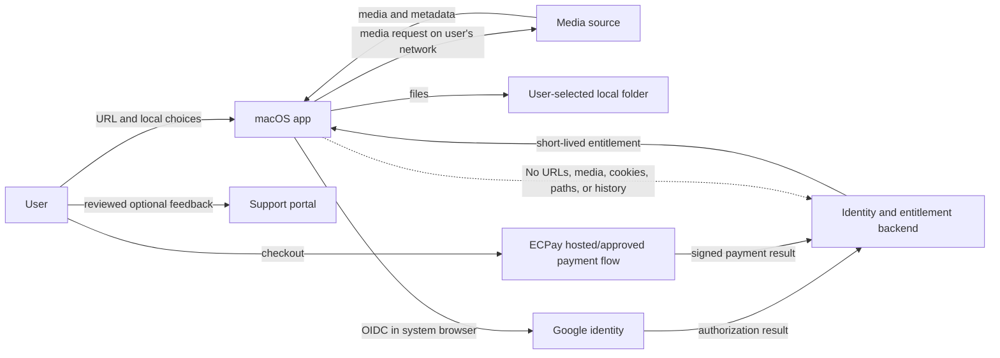

# YT Downloader Pro Privacy Data Map

## Document Control

| Field | Value |
| --- | --- |
| Status | Phase 1 architecture draft |
| Product owner | Ta-Chou Weng |
| Prepared | 2026-08-26 |
| Scope | Current macOS Swift 2.0 plus proposed account, billing, and support services |
| Default posture | Local-first, minimum collection, explicit sharing |

This is an engineering data inventory, not a final Privacy Policy. Legal counsel
must review the final data flows, vendors, notices, retention periods, and user
rights before paid launch.

## 1. Non-Negotiable Privacy Boundary

The entitlement and payment backend does not need to know what a user downloads.
By default it must never receive:

- Media page URLs, video IDs, playlist IDs, titles, channel names, or thumbnails.
- Downloaded media, subtitles, metadata, or partial files.
- Output filenames, local folders, security-scoped bookmarks, or filesystem
  paths.
- Chrome/Safari cookies, cookie databases, authorization headers, PO Tokens,
  account credentials, or yt-dlp command lines containing sensitive arguments.
- Local download history or detailed diagnostics.

An authenticated account proves subscription entitlement only. It is not a
license to monitor download activity.

## 2. Data Zones

| Zone | Owner | Network behavior | Sensitivity |
| --- | --- | --- | --- |
| App local state | User's Mac | No operator upload by default | High because it reveals media activity and paths |
| macOS Keychain | User's Mac | Tokens sent only to the issuing service | Critical |
| Identity backend | Operator | Receives minimum account identity | High |
| Billing backend | Operator plus ECPay | Receives payment references and status, never card data | High |
| Support system | Operator | Receives only user-reviewed submission | Variable/high |
| Optional history sync | Operator | Disabled and postponed until separately approved | Very high |
| Aggregate product analytics | Operator | Not approved for implementation | Medium/high depending on design |

No production database, analytics SDK, crash reporter, or support vendor is
approved merely by appearing in this map. Each requires a vendor assessment,
data-processing terms, retention configuration, and update to the public notice.

### Implemented Phase 1 Local Authentication Skeleton

The current app has no real account, identity provider, backend, billing, or
entitlement delivery. Its development-only local mock skeleton is enabled only
by exact `YTDP_AUTH_MODE=mock`; the normal disabled mode shows no account UI
and performs no credential lookup. Google and Apple are synthetic provider
labels, not live identity integrations.

In mock mode, the app keeps one local Keychain envelope for the active session
in the `com.catstayathome.YTDownloaderPro.auth.mock` service under the
`active-session` account key. It contains a synthetic provider, opaque mock
account identifier, synthetic display label, mock plan label, expiry, and
opaque mock refresh credential. The short-lived mock access token remains in
memory only. The record is device-only and is not synchronized. Retention ends
at mock sign-out, replacement, or scoped deletion of that mock record.

No authentication diagnostic may contain credentials, complete account IDs,
email addresses, Keychain data, raw provider errors, media URLs, titles,
paths, cookies, history, jobs, billing data, or entitlement data. The skeleton
does not upload or submit any of this data. The proposed account and billing
inventory below is not implemented.

## 3. Current macOS Local Data

Current Swift 2.0 behavior was mapped from `DownloadJob`, `DownloadOptions`,
`AppSettings`, `PersistenceController`, `ThumbnailCache`, and
`DiagnosticsLogger` as of 2026-08-26.

### 3.1 Download history and queue

Stored under the user's Application Support directory in a versioned snapshot:

- Random job UUID.
- Source URL and optional playlist identity.
- Media title, title source, duration, and source metadata.
- Job status, progress, bytes, speed, estimated time, and retry count.
- Reserved output basename and final output URL/path.
- Format, subtitle, thumbnail, metadata, cookie-mode, and output options.
- Thumbnail-cache path.
- Sanitized failure category/detail.
- Created, started, updated, and completed timestamps.

Purpose: restore the queue, display history, retry failed work, and safely manage
job-owned files. Storage: local only. Default retention: until the user clears a
record. Clearing a record must not delete the downloaded media unless the user
chooses a separately named file-deletion action.

The current model stores the source address in both `sourceURL` and, in common
flows, `sourceMetadata`. Engineering should later remove the duplication or
define a distinct non-duplicative purpose before schema 2.

### 3.2 Thumbnails

Stored as one validated image file associated with a random job UUID.

Purpose: display local download cards after relaunch. Storage: local only.
Retention: follows the job record. The cache must not use a video title, URL, or
account identifier as its filename.

### 3.3 Output-folder access

The app stores a security-scoped bookmark and display path for the selected
output directory.

Purpose: remember and regain access to the user-selected folder. Storage: local
settings only. The bookmark and path must never be included in telemetry,
support, entitlement, or history-sync payloads.

### 3.4 Cookie selection

The app stores only the selected mode: none, Chrome, or Safari. When selected,
yt-dlp reads browser cookies locally for that job. The operator does not need
the cookies and must not copy, upload, log, synchronize, or back them up.

The UI must explain that choosing a browser may expose that browser's signed-in
session to the local helper process. Cookie use must remain off by default and
be subject to legal review before commercial launch.

### 3.5 Diagnostics

The app keeps rotating JSONL diagnostics locally. Existing sanitization removes
or masks structured URL query values, cookie/auth arguments, tokens, signatures,
and sensitive command arguments.

Purpose: diagnose failures without requiring raw helper output. Storage: local
only. Current technical retention: bounded rotating files. Before any support
upload, diagnostics require a second export-time sanitization and user preview.

Sanitization reduces risk but is not proof that a log is anonymous. Titles,
paths, unusual error text, IP addresses, or identifiers may still identify a
user or activity and must be tested with adversarial fixtures.

Support-report preview, local export, and local deletion rules are specified in
`SUPPORT_REPORT_AND_DATA_REQUESTS.md`.

### 3.6 App settings

Stored in local `UserDefaults`:

- Maximum concurrent downloads.
- Language override.
- Default download options and output-folder bookmark/path.
- Automatic update-check preference.

These settings are not account data and must remain local unless a future
settings-sync feature is separately designed and enabled by the user.

## 4. Proposed Account And Entitlement Data

The minimum operator-side account record is:

| Field | Purpose | Rule |
| --- | --- | --- |
| Internal random user ID | Stable database key | Never expose sequential IDs |
| Google issuer plus `sub` | Bind the Google identity | Primary external identity; do not key by email |
| Email | Contact, recovery, receipts where necessary | Treat as mutable; do not use as authorization key |
| Email verification state | Account safety | Prefer identity-provider assertion; record minimum evidence |
| Locale/time zone | Transactional communication | Optional and user-changeable |
| Account created/updated times | Audit and lifecycle | Retain only as required |
| Account state | Active, suspended, deletion pending, deleted | Reasons require access controls |
| Terms/privacy version and consent time | Prove accepted terms | Preserve applicable legal evidence |

Google profile photo, contacts, YouTube channel data, Drive data, gender,
birthday, and other Google scopes are not required. Request only OpenID,
verified email, and the minimum profile scope counsel approves.

Authentication uses the system browser, Authorization Code with PKCE, exact
redirect allowlists, state and nonce validation, and short-lived app sessions.
Long-lived refresh credentials belong in Keychain. Google client secrets,
ECPay keys, and backend signing keys never ship in the app.

## 5. Proposed Billing Data

The operator may need:

- Internal subscription ID and user ID.
- ECPay merchant order/reference identifiers.
- Plan, amount, currency, billing interval, and current period dates.
- Authorization outcome, failure category, retry count, and provider timestamps.
- Subscription state: pending, active, grace, past due, cancelled, expired,
  refunded, disputed, or suspended.
- Cancellation request/effective times and refund/chargeback references.
- Evidence of recurring-payment consent and accepted terms version.
- Invoice/receipt references required by law.

The operator must not collect or store full card number, card verification code,
raw payment form fields, bank credentials, or ECPay secret keys in the app or
general application database. Payment entry must occur on an approved ECPay
surface or another PCI-reviewed integration.

Payment webhooks are untrusted input until signature verification, timestamp/
replay checks, idempotency, order reconciliation, and server-side query confirm
the event. A webhook does not directly grant an app entitlement without the
billing state machine accepting the transition.

## 6. Proposed Device And Session Data

Avoid hardware fingerprinting. If device limits are later needed, use a random
installation ID generated by the app and stored in Keychain.

Permitted minimum fields:

- Random installation ID.
- User ID.
- App version and supported platform family.
- First/last authorization times.
- Revoked time and reason.

Do not collect serial number, MAC address, advertising identifier, complete
hardware profile, local username, hostname, or installed-app inventory.

IP address and user agent may appear in ordinary server security logs. They
must have a defined security purpose, restricted access, short retention, and
must not be repurposed for download profiling or advertising.

## 7. In-App Feedback And Support Data

The app should offer `Help > Send Feedback` and an equivalent settings entry.
The first version should open an operator-controlled HTTPS form or support
portal rather than silently sending email or uploading logs.

Categories:

- Download or analysis failure.
- App defect or crash.
- Feature suggestion.
- Subscription, cancellation, or payment question.
- Privacy or account request.
- Copyright or misuse complaint.

Always visible to the user before submission:

- Message text.
- Reply email/account.
- App version, macOS version, architecture, and locale.
- Selected category and optional job error category.
- Exact diagnostic excerpt or export selected for attachment.

Never selected by default:

- Source URL, title, playlist, thumbnail, output path, or history.
- Full diagnostic directory.
- Browser or payment cookies/tokens.
- Screenshots.

When a URL is necessary to reproduce a downloader failure, the form must ask
separately, explain that it reveals viewing/download activity, and allow removal
before submission. Payment support must use ECPay/internal order references,
never card data.

Abuse controls may include account-aware rate limits, CAPTCHA for anonymous
forms, attachment type/size limits, malware scanning, and staff access roles.
They must not become covert tracking.

## 8. Optional History Synchronization

Recommendation: postpone cloud history synchronization until after the first
paid launch, even if marketed as a future Pro benefit. It is not required for
billing and creates the highest privacy sensitivity.

Before implementation it needs a separate approved design covering:

- Explicit opt-in, off by default.
- Field-level inventory and user-visible explanation.
- Client-side encryption feasibility and key recovery trade-offs.
- Conflict resolution and multi-device deletion.
- Per-item deletion, complete export, and complete server deletion.
- Retention and backup expiry.
- Staff access prevention and audit logs.
- Account closure and subscription-expiry behavior.

No raw cookies, media files, output paths, local bookmarks, or diagnostics may
be included in history synchronization.

## 9. Product Analytics

No third-party analytics SDK is approved. Phase 1 demand validation may use
aggregate landing-page metrics after a cookie/privacy review, but the desktop
app should launch without behavioral tracking unless a specific measurement is
shown to be necessary.

Permitted candidates after review:

- Anonymous app-version update-check counts using coarse aggregation.
- Aggregate feature reliability counts that cannot identify media or users.
- Opt-in crash reports with preview/redaction.

Prohibited analytics:

- Download URLs, titles, channels, formats tied to identity, or history.
- Cross-app advertising identifiers or fingerprinting.
- Session replay or screenshots of the desktop app.
- Selling or sharing activity for advertising.

## 10. Retention Baseline For Legal Review

These are conservative engineering proposals, not final legal retention rules:

| Data | Proposed retention |
| --- | --- |
| Local jobs and thumbnails | Until user clears them |
| Local rotating diagnostics | Size/rotation bounded; user can clear all |
| Active account identity | While account is active |
| Deleted account identity | Delete/anonymize promptly except required legal records |
| Session/refresh tokens | Until expiry, revocation, logout, or account deletion |
| Subscription and consent evidence | Legal/accounting period confirmed by counsel |
| Payment provider references | Legal/accounting and dispute period confirmed by counsel |
| Server security logs | Short fixed period, proposed 30 days unless incident hold |
| Support tickets | Proposed 12 months after closure, then delete/anonymize unless needed |
| Copyright/misuse disputes | Counsel-defined period with restricted access |
| Optional synchronized history | Until per-item deletion, opt-out, or account deletion; short backup expiry |

No record is retained "forever" without a specific documented legal or product
purpose. Legal holds must be scoped, access-controlled, and auditable.

## 11. User Rights And Controls

The final product and website must provide:

- View and correct account/contact information.
- Download a machine-readable account and subscription export.
- Clear local history and diagnostics independently of downloaded media.
- Delete individual support/history records where legally available.
- Revoke devices and sessions.
- Disconnect Google without losing a paid account before another login/recovery
  method is established.
- Cancel renewal without deleting the account.
- Delete the account through a documented, confirmed process.
- Contact routes for privacy and security requests.

Account deletion must not silently cancel or fail to cancel an ECPay recurring
authorization. The workflow must stop future billing first, reconcile the
result, then delete/anonymize eligible account data.

## 12. Security Controls

Minimum pre-launch controls:

- TLS for all operator endpoints and strict redirect/callback allowlists.
- Keychain storage for app refresh credentials.
- Server-side secrets in a managed secret store with rotation.
- Separate development, staging, and production ECPay credentials/data.
- Least-privilege staff/admin roles and phishing-resistant MFA.
- Encryption at rest for production databases and backups.
- Append-only security and billing audit events without download activity.
- Webhook signature verification, replay protection, and idempotency.
- Dependency and secret scanning, protected production deployment, and rollback.
- Tested backup restoration, account deletion, incident response, and key
  rotation.
- Sanitized support exports and adversarial redaction tests.

Production data must never be copied into development fixtures. Tests use
synthetic identities, orders, paths, URLs, and diagnostics.

## 13. Data Flow Summary

The dotted no-data boundary is an enforceable interface requirement, not merely
a privacy-policy statement.

## 14. Open Decisions

- Final identity-provider and account-recovery options.
- Backend hosting region and vendors.
- Legal retention periods and data-controller disclosures.
- Whether any product analytics are necessary.
- Whether support is account-only or also accepts anonymous reports.
- Whether cloud history is postponed indefinitely or developed after launch.
- Exact paid device limit, if any.
- Final account deletion and ECPay cancellation ordering after provider review.

## 15. Verification Gates

- [ ] Current local data map is checked against the release build, not only source.
- [ ] Every backend field has purpose, basis, retention, access role, and deletion behavior.
- [ ] Network inspection proves normal downloads do not contact the operator backend with activity data.
- [ ] Support preview proves unselected fields are absent from the request body.
- [ ] Redaction fixtures cover URLs, paths, cookies, headers, tokens, emails, and unusual helper output.
- [ ] Logout, device revocation, cancellation, export, and deletion are end-to-end tested.
- [ ] Privacy policy and in-app notices match observed network and storage behavior.
- [ ] Counsel approves the final map and vendors.

## 16. Primary References

- [Taiwan Personal Data Protection Act](https://mojlaw.moj.gov.tw/ENG/LawContentE.aspx?LSID=FL010627)
- [YouTube API Services Developer Policies: privacy requirements](https://developers.google.com/youtube/terms/developer-policies)
- [Google OpenID Connect](https://developers.google.com/identity/openid-connect/openid-connect)
- [Apple Keychain Services](https://developer.apple.com/documentation/security/keychain-services)
