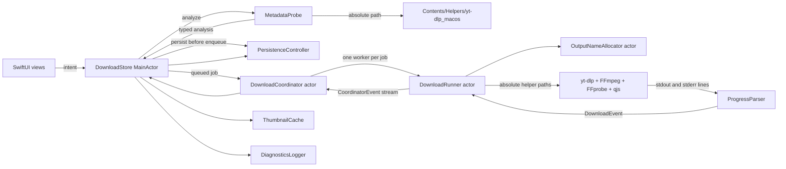
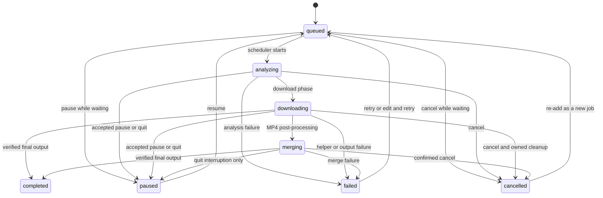

# Swift 2.0 Architecture

## Product Boundary

YT Downloader Pro 2 is a native SwiftUI app for macOS 13 or later. macOS uses
the `2.x` line and `updates/macos.json`. Windows remains the Python/Tkinter
`1.8.x` line and `updates/windows.json`. The macOS app does not import the Python
application and neither platform compares itself with the other platform's
version.

The app has no background daemon. Downloads stop safely during quit and are
restored as paused; they do not continue after the process exits.

## Module Boundaries

| Area | Owner | May depend on | Must not own |
| --- | --- | --- | --- |
| `App/` | Scene and `NSApplicationDelegate` lifecycle | Store | Helper arguments or persistence format |
| `Views/` | Rendering, dialogs, focus, accessibility, user intent | `DownloadStore`, presentation values | Process launch or shared mutable job state |
| `Stores/` | Main-actor UI source of truth and command routing | Actors and value services | Raw process handles |
| `Models/` | Codable and Sendable domain values, localization keys | Foundation | UI or process execution |
| `Process/` | Foundation `Process`, dual-pipe streaming, interruption | Foundation | Download policy |
| `Services/` | One behavior per actor/value service | Models and process protocols | View composition |
| `Resources/` | String catalog and metadata | SwiftPM | Writable application state |

The package has one executable target, `YTDownloaderPro2`, and one XCTest
target. Swift strict-concurrency checks are part of every release gate.

## Service Ownership

| Service | Isolation | Owned state and responsibility |
| --- | --- | --- |
| `DownloadStore` | `@MainActor` class | Published jobs, selection, sidebar filter, analysis/update presentation, settings, and translation of service events into legal UI state |
| `DownloadCoordinator` | Actor | FIFO queue, active workers, limit 1 through 10, Start Now promotion, pause/cancel/shutdown joining, and ordered `CoordinatorEvent` stream |
| `DownloadRunner` | Actor | One active helper process per job, retry/reanalysis, pause/cancel/quit semantics, owned artifacts, and output reservation lifecycle |
| `PersistenceController` | Actor | Schema-1 job snapshots, 50 ms progress-save coalescing, immediate flushes, atomic replacement, and prior-snapshot recovery |
| `OutputNameAllocator` | Actor | Cross-task basename reservation and UUID marker ownership |
| `ThumbnailCache` | Actor | Validated image decode, UUID filenames, atomic replacement, symlink-safe cache mutations |
| `DiagnosticsLogger` | Actor | Sanitized JSONL events, 5 MiB rotation, three retained generations, interrupted-rotation recovery |
| `MetadataProbe` | Value service | URL analysis, bounded YouTube client fallback, typed video/playlist JSON decoding |
| `ToolchainValidator` | Value service | Real version execution for all four canonical helpers and FFmpeg/FFprobe family agreement |
| `UpdateChecker` | Value service | Bounded HTTPS GitHub Contents API transport, strict macOS manifest validation, SemVer comparison |

Views call the Store only. The Store is the UI-facing authority; actors own
mutable scheduling, file, process, cache, and diagnostic state.

## Data Flow



Analysis and download arguments are centralized in `YouTubeStrategy`. They use
the bundled QuickJS path, never disable TLS verification, and add browser-cookie
arguments only after explicit Chrome or Safari selection. Normal uncookied work
uses `web_embedded` first and at most one bundled-default fallback for a
retryable 403/client failure.

Structured yt-dlp templates emit progress, phase, and final-path markers.
Human-readable stderr is sanitized diagnostic input, not the primary state
protocol or user-facing alert.

## Job State

Persisted statuses are `queued`, `analyzing`, `downloading`, `paused`, `merging`,
`completed`, `failed`, and `cancelled`.



`DownloadJob.transition` enforces three model-level invariants: merging cannot
be user-paused, a terminal job cannot regress directly to an active state, and a
queued job cannot complete without running. Store and coordinator command gates
apply the narrower lifecycle shown above. Sidebar mapping is:

- Running: queued, analyzing, downloading, merging.
- Stopped: paused, cancelled.
- Completed: completed.
- Failed: failed.

## Queue And Concurrency

`DownloadCoordinator` owns FIFO `queuedIDs` and an active worker dictionary.
The limit is clamped to 1 through 10 and defaults to 5. Increasing it fills new
slots immediately. Decreasing it never terminates active work; no replacement
starts until the active count falls below the new limit. Start Now moves one
eligible ID to the front without bypassing capacity.

Every worker has a generation token. Stale events, repeated control commands,
and duplicate enqueue attempts cannot run one job twice. Pause/cancel control
tasks are joinable. `shutdown()` stops admission, joins every control and worker
task, then closes the event stream exactly once.

## Pause, Cancel, Retry, And Quit

- Pause during analysis interrupts the probe. Pause during download interrupts
  yt-dlp and retains compatible partials and the reservation marker.
- User pause is rejected during merge/post-processing. Quit uses the separate
  `interruptForQuit` path, preserving source streams and removing only an owned
  incomplete destination.
- Cancel waits for process termination, then removes only artifacts whose marker
  still proves job ownership. It never removes a pre-existing file.
- Retry reanalyzes before download. If a saved explicit format is gone, the job
  requires a new selection instead of silently changing quality.
- `AppLifecycle.applicationShouldTerminate` returns `.terminateLater` and calls
  `DownloadStore.prepareToQuit()`. The app exits only after coordinator shutdown
  and a flushed snapshot succeed.

## Persistence

All writable state is outside the app bundle:

```text
~/Library/Application Support/YT Downloader Pro/
  downloads.json
  State/
    downloads.next
    downloads.previous
  Thumbnails/
    <JOB-UUID>.jpg|png|gif|webp
  Diagnostics/
    diagnostics.jsonl
    diagnostics.1.jsonl ... diagnostics.3.jsonl
    diagnostics.rotation.json
```

`downloads.json` is a Codable envelope containing `schemaVersion: 1` and
`jobs: [DownloadJob]`. A job stores source identity, title metadata, status,
progress metrics, reserved basename, output URL, immutable running options,
sanitized failure, retry count, and timestamps. `DownloadOptions` stores output
kind, selected format identity/presentation, subtitle mode/language, embedding
flags, cookie mode, and output-directory bookmark/display path.

Writes stage through `State/downloads.next`, preserve the last valid primary as
`State/downloads.previous`, and atomically replace the primary. The first valid
save seeds both primary and previous. On load, primary is preferred and previous
is the recovery source. Active persisted jobs restore as paused; queued and
terminal states remain unchanged.

Settings are a Codable value in `UserDefaults` under `app-settings`. The
concurrency limit is clamped during decode and save. Output folders use
security-scoped bookmarks; stale or unreadable bookmarks require reselection.

## Security And Privacy

- Production helper resolution is restricted to four regular executable files
  under `Contents/Helpers`; symlink escapes and PATH/Homebrew fallback are
  rejected.
- Packaging rejects symlinks, hard-link inode aliases, duplicate/misplaced
  helpers, extra executables, missing slices, unexpected dynamic dependencies,
  invalid signatures, and writable state paths in the app.
- Helper execution uses absolute paths. Cookies are opt-in and cookie contents,
  authorization headers, URL credentials/signatures, and PO Tokens are never
  persisted or logged.
- Thumbnail roots and leaf mutations are revalidated against symlinks. Output
  deletion requires the job's reservation marker. Completed media is not removed
  with history.
- Update transport requires HTTPS and the expected GitHub API origin/path after
  redirects, bounds the Contents response to 192 KiB and decoded manifest to 96
  KiB, and treats cancellation as terminal.

## Localization And Updates

`Localizable.xcstrings` contains English, Japanese, and Traditional Chinese.
The app follows the system locale unless settings contain `en`, `ja`, or
`zh-Hant`. Packaging also compiles `en.lproj`, `ja.lproj`, and
`zh-Hant.lproj`; runtime catalog lookup prefers `Contents/Resources` and falls
back to SwiftPM `Bundle.module` in development/tests.

The macOS checker reads only the GitHub Contents API path for
`updates/macos.json`. Automatic transient failures remain quiet; manual checks
always produce a result. A valid manifest requires platform `macos`, strict
versions, minimum macOS, credential-free HTTPS URLs, lowercase SHA-256,
publication time, and release notes. Windows manifest parsing remains in the
Python line and is not shared with this executable.
